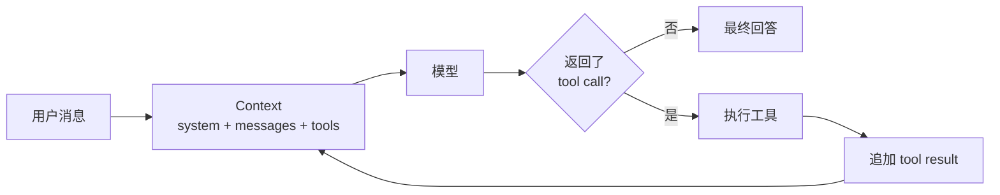

# Building Agents from Scratch

📚 **[在线阅读完整中文文档](https://daiwk.github.io/building-agents-from-scratch/)**

一个把 Agent 核心逻辑重新写到足够小的教学项目，同时提供 Python、TypeScript、
Notebook 和直接使用 [pi-agent](https://github.com/earendil-works/pi) 的对照版本。

目标不是再造一个功能最多的 Agent 框架，而是让初学者能在十分钟内回答：

1. Agent 和普通聊天有什么区别？
2. 模型如何调用工具？
3. 工具结果如何回到模型？
4. memory、skills、sub-agent 和 graph 应该接在哪里？

> 原 `@mariozechner/pi-agent-core` 包已弃用并指向
> `@earendil-works/pi-agent-core`。本项目不依赖弃用包，而是学习其
> `context + agent loop + events + tools` 的分层方式。

## 一眼看懂 Agent



普通聊天只走一次 `用户 → 模型 → 回答`。Agent 多了一个反馈环：
模型可以暂停回答、请求执行工具；程序执行后把结果加入消息历史，再调用模型。

第一次学习建议先运行
[`notebooks/agent_from_scratch.ipynb`](notebooks/agent_from_scratch.ipynb)，再选择阅读
Python 或 TypeScript 核心：

1. [`python/from_scratch_agent/agent.py`](python/from_scratch_agent/agent.py)：语法负担最小的同步循环；
2. [`src/core/types.ts`](src/core/types.ts)：带中文语法解释的数据类型；
3. [`src/core/agent-loop.ts`](src/core/agent-loop.ts)：异步 Agent 算法；
4. [`examples/pi-agent-direct.ts`](examples/pi-agent-direct.ts)：同一案例的成熟库写法。

完整使用说明由 MkDocs Material 构建。合并到 `main` 后，GitHub Actions 会发布到
`https://daiwk.github.io/building-agents-from-scratch/`。

## 快速开始

要求 Node.js 22.19+。Python 版本要求 3.11+。

```bash
npm install
python3 -m venv .venv
.venv/bin/python -m pip install -r requirements-docs.txt
cp .env.example .env
```

在 `.env` 中填入国内版 MiniMax Token Plan Key：

```dotenv
MINIMAX_API_KEY=sk-cp-...
MINIMAX_BASE_URL=https://api.minimaxi.com/anthropic/v1
AGENT_PROVIDER=minimax
```

然后运行网页版：

```bash
npm run web
```

浏览器访问 [http://127.0.0.1:3000](http://127.0.0.1:3000)。页面左侧是对话，
右侧会按真实顺序展示 model、tool call、tool result 和最终回答。

如果更喜欢终端，也可以运行：

```bash
npm run dev
```

尝试输入：

```text
请精确计算 1234 * 5678，再告诉我上海现在几点。
```

终端会同时展示 tool call、tool result 和最终答案，因此可以直接观察整个 loop。

### 不用 API Key，先跑 Python / Notebook

```bash
PYTHONPATH=python .venv/bin/python -m unittest discover -s python/tests -v
.venv/bin/jupyter notebook notebooks/agent_from_scratch.ipynb
```

Notebook 默认使用可预测的假模型，不访问网络、不消耗额度。最后一个真实 MiniMax
单元格还需要显式设置 `RUN_LIVE_MINIMAX=1` 才会执行。

MiniMax 后端默认使用国内站官方
[Anthropic-compatible Messages API](https://platform.minimaxi.com/docs/api-reference/text-chat-anthropic)：

```text
https://api.minimaxi.com/anthropic/v1/messages
```

Token Plan Key 和普通按量 API Key 不可混用；个人交互适合 Token Plan，生产服务应按官方建议评估按量方案。
国内版和国际版 Token Plan Key 也属于不同服务区域。国际站用户需要把
`MINIMAX_BASE_URL` 改为 `https://api.minimax.io/anthropic/v1`。

## 最小用法

```ts
import { Agent } from "./src/core/index.js";
import { MiniMaxProvider } from "./src/providers/index.js";
import { calculatorTool } from "./src/tools/index.js";

const agent = new Agent({
  model: new MiniMaxProvider({
    apiKey: process.env.MINIMAX_API_KEY!,
  }),
  tools: [calculatorTool],
  systemPrompt: "You are helpful. Use tools for exact arithmetic.",
});

for await (const event of agent.run("1234 * 5678 是多少？")) {
  if (event.type === "toolStart") console.log(event.call);
  if (event.type === "toolEnd") console.log(event.result);
  if (event.type === "text") console.log(event.text);
}
```

使用 async iterator 是有意的：CLI、Web UI、日志系统和调试器都可以消费相同事件，
而核心循环不依赖任何界面。

## 直接使用 pi-agent

项目同时保留一个不经过教学循环、直接调用 `@earendil-works/pi-agent-core` 的版本：

```bash
# 只检查模型与工具装配，不请求网络
npm run pi-check

# 真实调用国内 MiniMax
npm run pi-example -- "精确计算 1234 × 5678"
```

pi-ai 的 `minimax-cn` provider 默认读取 `MINIMAX_CN_API_KEY`。为了和本项目其余入口一致，
示例也接受 `MINIMAX_API_KEY` 并在进程内完成映射。

## 使用本机 Codex

本机已登录相应 CLI 时：

```bash
AGENT_PROVIDER=codex npm run dev
```

这个后端是实验性的。Codex CLI 本身已经是 Agent，而不是裸模型 API；
适配器会以只读 sandbox 启动它并取得最终文本，因此不会再把本项目的工具传进去。
若要让它成为真正的底层模型后端，下一步应接它的 app-server 协议，而不是套娃式
CLI 调用。

## 目录

```text
src/
├── core/
│   ├── types.ts          # 消息、工具、模型、事件协议
│   ├── agent-loop.ts     # 唯一的控制循环
│   └── agent.ts          # 有状态 Agent
├── runtime/
│   └── create-agent.ts   # CLI / Web 共用的装配入口
├── providers/
│   ├── minimax.ts        # Anthropic-compatible API
│   └── codex-cli.ts      # Codex CLI（实验性）
├── tools/
│   ├── calculator.ts
│   └── current-time.ts
├── web/
│   └── server.ts         # HTTP + NDJSON 事件流
└── cli.ts

web/
├── index.html            # 零框架页面
├── styles.css
└── app.js

python/from_scratch_agent/ # Python 教学实现
notebooks/                # 可逐格调试的教程
examples/pi-agent-direct.ts
docs/                     # MkDocs 使用说明
mkdocs.yml
```

## 设计原则

- 状态显式：全部对话都在 `AgentContext.messages`，没有隐藏全局状态。
- 协议小而稳定：模型只需实现 `ModelProvider.generate()`，工具只需实现 `Tool.execute()`。
- 错误可恢复：工具不存在或执行失败时，错误会成为 `ToolResultMessage`，模型可以调整策略。
- 输入有边界：模型生成的工具参数会先通过 JSON Schema 子集校验，再执行真实函数。
- 调用可恢复：模型请求支持 timeout、选择性 retry、指数退避和用户取消。
- 循环有上限：默认最多 8 轮，避免失控和意外消耗额度。
- 高级能力外置：memory、skills、观测和策略通过 hooks 或 context 变换实现。
- 默认安全：本机 CLI 后端使用只读 sandbox；示例工具不执行 shell、不写文件。

## 下一步怎么扩展

详细路线见 [`docs/roadmap.md`](docs/roadmap.md)，接口关系见
[`docs/architecture.md`](docs/architecture.md)。

推荐迭代顺序：

1. streaming model events；
2. 可持久化 memory 与 context compaction；
3. skills 的发现、选择和 prompt 注入；
4. 把 Agent 包装成 Tool，实现 sub-agent；
5. scheduler + shared event bus，实现 multi-agent；
6. 用状态节点和条件边实现 graph；
7. eval + versioned artifacts + approval gate，实现受控 self-evolve。

## 验证

```bash
npm run check
npm run pi-check
PYTHONPATH=python .venv/bin/python -m unittest discover -s python/tests -v
.venv/bin/jupyter nbconvert --execute --to notebook --inplace notebooks/agent_from_scratch.ipynb
.venv/bin/mkdocs build --strict
```

测试不访问真实模型 API，使用脚本化假模型验证直答、工具循环、错误恢复和
Web NDJSON 事件流。

本地预览文档站：

```bash
.venv/bin/mkdocs serve
```

## 当前边界

- MiniMax 首版使用非流式 HTTP 响应，Agent 事件接口已为后续 token streaming 保留。
- 工具参数目前依赖工具自己校验；下一步可以接 JSON Schema validator。
- 对话仅存内存，进程退出即消失。
- 暂未实现并行工具调用、重试、限流、成本预算和人工审批。

这些不是被隐藏的缺陷，而是后续章节各自清晰的练习边界。
