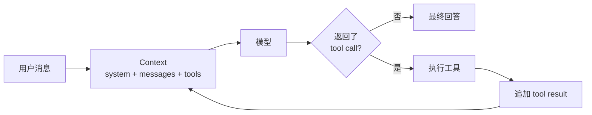

# Building Agents from Scratch

📚 **[在线阅读完整中文文档](https://daiwk.github.io/building-agents-from-scratch/)**

一个把 Agent 核心逻辑重新写到足够小的教学项目，同时提供 Python、TypeScript、
Notebook 和直接使用 [pi-agent](https://github.com/earendil-works/pi) 的对照版本。

目标不是再造一个功能最多的 Agent 框架，而是让初学者能在十分钟内回答：

1. Agent 和普通聊天有什么区别？
2. 模型如何调用工具？
3. 工具结果如何回到模型？
4. memory、skills、sub-agent 和 graph 应该接在哪里？

> 原 `@mariozechner/pi-agent-core` 包已弃用并指向
> `@earendil-works/pi-agent-core`。本项目不依赖弃用包，而是学习其
> `context + agent loop + events + tools` 的分层方式。

## 一眼看懂 Agent



普通聊天只走一次 `用户 → 模型 → 回答`。Agent 多了一个反馈环：
模型可以暂停回答、请求执行工具；程序执行后把结果加入消息历史，再调用模型。

第一次学习建议先运行
[`notebooks/agent_from_scratch.ipynb`](notebooks/agent_from_scratch.ipynb)，再选择阅读
Python 或 TypeScript 核心：

1. [`python/from_scratch_agent/agent.py`](python/from_scratch_agent/agent.py)：语法负担最小的同步循环；
2. [`src/core/types.ts`](src/core/types.ts)：带中文语法解释的数据类型；
3. [`src/core/agent-loop.ts`](src/core/agent-loop.ts)：异步 Agent 算法；
4. [`examples/pi-agent-direct.ts`](examples/pi-agent-direct.ts)：同一案例的成熟库写法。

完整使用说明由 MkDocs Material 构建。合并到 `main` 后，GitHub Actions 会发布到
`https://daiwk.github.io/building-agents-from-scratch/`。

## 快速开始

要求 Node.js 22.19+。Python 版本要求 3.11+。

```bash
npm install
python3 -m venv .venv
.venv/bin/python -m pip install -r requirements-docs.txt
cp .env.example .env
```

在 `.env` 中填入国内版 MiniMax Token Plan Key：

```dotenv
MINIMAX_API_KEY=sk-cp-...
MINIMAX_BASE_URL=https://api.minimaxi.com/anthropic/v1
AGENT_PROVIDER=minimax
```

然后运行网页版：

```bash
npm run web
```

浏览器访问 [http://127.0.0.1:3000](http://127.0.0.1:3000)。页面左侧是对话，
右侧会按真实顺序展示 model、tool call、tool result 和最终回答。

高级组件实验台位于
[http://127.0.0.1:3000/playground.html](http://127.0.0.1:3000/playground.html)，
不需要 API Key，可以逐步观察 Memory、Skills、Sub-agent、Graph、Eval、Workspace、MCP、
Structured Output、模型路由和 Durable Runtime。

如果更喜欢终端，也可以运行：

```bash
npm run dev
```

尝试输入：

```text
请精确计算 1234 * 5678，再告诉我上海现在几点。
```

终端会同时展示 tool call、tool result 和最终答案，因此可以直接观察整个 loop。

### 不用 API Key，先跑 Python / Notebook

```bash
PYTHONPATH=python .venv/bin/python -m unittest discover -s python/tests -v
.venv/bin/jupyter notebook notebooks/agent_from_scratch.ipynb
```

Notebook 默认使用可预测的假模型，不访问网络、不消耗额度。最后一个真实 MiniMax
单元格还需要显式设置 `RUN_LIVE_MINIMAX=1` 才会执行。

MiniMax 后端默认使用国内站官方
[Anthropic-compatible Messages API](https://platform.minimaxi.com/docs/api-reference/text-chat-anthropic)：

```text
https://api.minimaxi.com/anthropic/v1/messages
```

Token Plan Key 和普通按量 API Key 不可混用；个人交互适合 Token Plan，生产服务应按官方建议评估按量方案。
国内版和国际版 Token Plan Key 也属于不同服务区域。国际站用户需要把
`MINIMAX_BASE_URL` 改为 `https://api.minimax.io/anthropic/v1`。

## 最小用法

```ts
import { Agent } from "./src/core/index.js";
import { MiniMaxProvider } from "./src/providers/index.js";
import { calculatorTool } from "./src/tools/index.js";

const agent = new Agent({
  model: new MiniMaxProvider({
    apiKey: process.env.MINIMAX_API_KEY!,
  }),
  tools: [calculatorTool],
  systemPrompt: "You are helpful. Use tools for exact arithmetic.",
});

for await (const event of agent.run("1234 * 5678 是多少？")) {
  if (event.type === "toolStart") console.log(event.call);
  if (event.type === "toolEnd") console.log(event.result);
  if (event.type === "text") console.log(event.text);
}
```

使用 async iterator 是有意的：CLI、Web UI、日志系统和调试器都可以消费相同事件，
而核心循环不依赖任何界面。

## 直接使用 pi-agent

项目同时保留一个不经过教学循环、直接调用 `@earendil-works/pi-agent-core` 的版本：

```bash
# 只检查模型与工具装配，不请求网络
npm run pi-check

# 真实调用国内 MiniMax
npm run pi-example -- "精确计算 1234 × 5678"
```

pi-ai 的 `minimax-cn` provider 默认读取 `MINIMAX_CN_API_KEY`。为了和本项目其余入口一致，
示例也接受 `MINIMAX_API_KEY` 并在进程内完成映射。

## 离线 Eval 与 Workspace Tools

运行随仓库提供的 baseline/candidate trace diff：

```bash
npm run eval -- run \
  --dataset examples/evals/dataset.jsonl \
  --baseline examples/evals/baseline.json \
  --candidate examples/evals/candidate.json
```

给真实 Agent 开放限定目录的只读文件工具：

```dotenv
AGENT_WORKSPACE_ROOT=.
AGENT_TOOLS=read_artifact,list_files,read_file,search_text
AGENT_WORKSPACE_ALLOW_WRITE=false
```

只有同时设置 `AGENT_WORKSPACE_ALLOW_WRITE=true` 并在 `AGENT_TOOLS` 选择 `write_file`，
模型才会看到写工具。项目不提供任意 shell 工具。

## 使用本机 Codex

本机已登录相应 CLI 时：

```bash
AGENT_PROVIDER=codex npm run dev
```

这个后端是实验性的。Codex CLI 本身已经是 Agent，而不是裸模型 API；
适配器会以只读 sandbox 启动它并取得最终文本，因此不会再把本项目的工具传进去。
若要让它成为真正的底层模型后端，下一步应接它的 app-server 协议，而不是套娃式
CLI 调用。

## MCP、Structured Output 与 Durable Runtime

MCP server 由宿主显式配置，工具 discovery 后仍要经过白名单：

```dotenv
AGENT_MCP_COMMAND=node
AGENT_MCP_ARGS=["path/to/server.js"]
AGENT_MCP_SERVER_NAME=docs
AGENT_MCP_TOOLS=lookup
AGENT_TOOLS=calculator,docs__lookup
```

`src/structured-output/` 提供 JSON parse、递归校验和有限 repair；`src/routing/` 提供显式
模型路由、fallback 及 generator/judge 隔离指标。`src/durable/` 使用 SQLite 保存 Graph
checkpoint、幂等 task、worker lease 和 append-only events。

## 目录

```text
src/
├── core/
│   ├── types.ts          # 消息、工具、模型、事件协议
│   ├── agent-loop.ts     # 唯一的控制循环
│   ├── agent.ts          # 有状态 Agent
│   ├── context-builder.ts # 本轮模型上下文裁剪
│   ├── budget.ts          # 单次任务的 token / 成本预算
│   ├── rate-limit.ts      # 跨任务共享的模型请求限流
│   └── tracing.ts         # run / model / tool 父子 span
├── runtime/
│   └── create-agent.ts   # CLI / Web 共用的装配入口
├── providers/
│   ├── anthropic-stream.ts # SSE 分帧与完整消息聚合
│   ├── minimax.ts        # Anthropic-compatible API
│   └── codex-cli.ts      # Codex CLI（实验性）
├── tools/
│   ├── calculator.ts
│   ├── current-time.ts
│   └── registry.ts        # 注册与按名称授权工具
├── memory/
│   ├── json-file-store.ts # 可直接阅读的本地会话
│   ├── sqlite-store.ts    # 多会话 SQLite 持久化
│   └── memory-index.ts    # 三类长期记忆与检索
├── skills/
│   ├── loader.ts          # 安全读取 SKILL.md
│   ├── catalog.ts         # 选择、发现并注入 skill
│   └── router.ts          # 根据用户输入动态选择
├── subagents/
│   ├── agent-as-tool.ts   # 结构化 child handoff 与 event bus
│   └── scheduler.ts       # 有界并行 multi-agent
├── graph/
│   └── runtime.ts         # node/edge/checkpoint/reducer/interrupt
├── evolution/
│   └── runtime.ts         # eval/holdout/approval/monitor/rollback
├── evals/
│   ├── replay.ts          # 固定 trace 的离线重放
│   └── cli.ts             # dataset diff 与 report
├── workspace/
│   ├── tools.ts           # 限定目录的安全文件工具
│   └── artifacts.ts       # 长工具输出的分段存储
├── mcp/                   # stdio MCP、白名单、超时取消与脱敏
├── structured-output/     # JSON 校验与有限 repair
├── routing/               # 模型选择、fallback 与隔离指标
├── durable/               # SQLite checkpoint、task queue 与 events
├── web/
│   └── server.ts         # HTTP + NDJSON 事件流
└── cli.ts

web/
├── index.html            # 零框架页面
├── playground.html       # Stage 2–12 组件实验台
├── styles.css
└── app.js

python/from_scratch_agent/ # Python 教学实现
notebooks/                # 可逐格调试的教程
examples/pi-agent-direct.ts
docs/                     # MkDocs 使用说明
mkdocs.yml
```

Python 与 pi-agent 对照版也支持工具选择、JSON/SQLite 会话 memory、分类 MemoryIndex、
版本化 SKILL.md、模型调用可靠性、单次任务预算和 OpenTelemetry-compatible trace。
Stage 13–14 还加入了带引用的混合检索、受限文件 Artifact 和图片 content block；
Web UI 可以直接上传文本或图片并观察它们如何进入模型消息。
Stage 6 的 EvolutionController 同时提供 TypeScript/Python 实现；pi-agent 可通过隔离的
system prompt 实例参与相同 evaluator。
三套实现使用相同 `AGENT_*` 环境变量；pi-agent 需要隔离时可用 `PI_AGENT_*`
覆盖工具、记忆和技能配置。详见文档站的“三种实现”章节。

## 设计原则

- 状态显式：全部对话都在 `AgentContext.messages`，没有隐藏全局状态。
- 协议小而稳定：模型只需实现 `ModelProvider.generate()`，工具只需实现 `Tool.execute()`。
- 能力显式授权：ToolRegistry 注册工具，但只有选中的工具才会开放给模型。
- 记忆可替换：ConversationStore 可以从内存实现切换到 JSON 或数据库。
- 上下文可裁剪：ContextBuilder 只改变本轮模型输入，不删除完整历史。
- Skill 只读：SKILL.md 只作为选中的指令注入，不会自动执行代码或获得工具权限。
- 子 Agent 隔离：agentAsTool 每次创建独立 child，不共享父 Agent 的可变消息数组。
- 错误可恢复：工具不存在或执行失败时，错误会成为 `ToolResultMessage`，模型可以调整策略。
- 输入有边界：模型生成的工具参数会先通过 JSON Schema 子集校验，再执行真实函数。
- 工具可并行：默认顺序执行；显式开启后并发运行，但结果仍按模型 call 顺序写回。
- 调用可恢复：模型请求支持 timeout、选择性 retry、指数退避和用户取消。
- 请求可节流：进程内平滑限流跨多次 run 共享，并把等待状态暴露给 UI。
- 输出可流式：MiniMax SSE 的文本与工具参数 delta 会实时进入 CLI/Web UI。
- 资源可观察：每个模型响应报告累计 usage，可按自定义币种与单价设置 soft budget。
- 调用可追踪：run、model、tool 形成父子 span，默认不记录 prompt 和工具参数。
- 循环有上限：默认最多 8 轮，避免失控和意外消耗额度。
- 高级能力外置：memory、skills、观测和策略通过 hooks 或 context 变换实现。
- 演进受控：模型只能提出版本化候选，eval gate 和人工审批通过后才能发布。
- 默认安全：本机 CLI 后端使用只读 sandbox；示例工具不执行 shell、不写文件。

## 下一步怎么扩展

详细路线见 [`docs/roadmap.md`](docs/roadmap.md)，接口关系见
[`docs/architecture.md`](docs/architecture.md)。

Stage 0–14 的教学闭环已经完成。后续可以把各个小接口替换成生产实现，例如持久化
ArtifactStore、组织审批系统、经过人工标注验证的 LLM judge，以及发布后的在线监控。

## 验证

```bash
npm run check
npm run pi-check
PYTHONPATH=python .venv/bin/python -m unittest discover -s python/tests -v
.venv/bin/jupyter nbconvert --execute --to notebook --inplace notebooks/agent_from_scratch.ipynb
.venv/bin/mkdocs build --strict
```

测试不访问真实模型 API，使用脚本化假模型验证直答、工具循环、错误恢复和
Web NDJSON 事件流。

本地预览文档站：

```bash
.venv/bin/mkdocs serve
```

## 当前边界

- TypeScript MiniMax 已支持 streaming；Python 教学 provider 仍保持同步完整响应。
- 工具参数校验只实现教学所需的 JSON Schema 子集，复杂 Schema 应接成熟 validator。
- 会话、摘要、分类 MemoryIndex 和 hybrid retrieval 已有教学实现；真实 embedding 与供应商 tokenizer 需通过接口接入。
- 上传 Artifact 当前只存在内存中；生产部署前必须补认证、租户隔离、扫描与对象存储。
- 并行工具没有事务回滚；共享写入、依赖链和逐个审批仍必须使用顺序模式。
- Stage 6 已提供程序化人工 gate；真实身份认证、审批 UI 和权限系统需由宿主应用接入。
- 正式 OTLP/SDK exporter 尚未实现；当前提供可替换的 JSONL 教学 exporter。
- MCP 当前覆盖 stdio tools；Resources、Prompts 与远程 transport 尚未接入。
- Durable Runtime 面向单机 SQLite；分布式 worker 还需要 heartbeat 和 dead-letter queue。

这些不是被隐藏的缺陷，而是后续章节各自清晰的练习边界。
