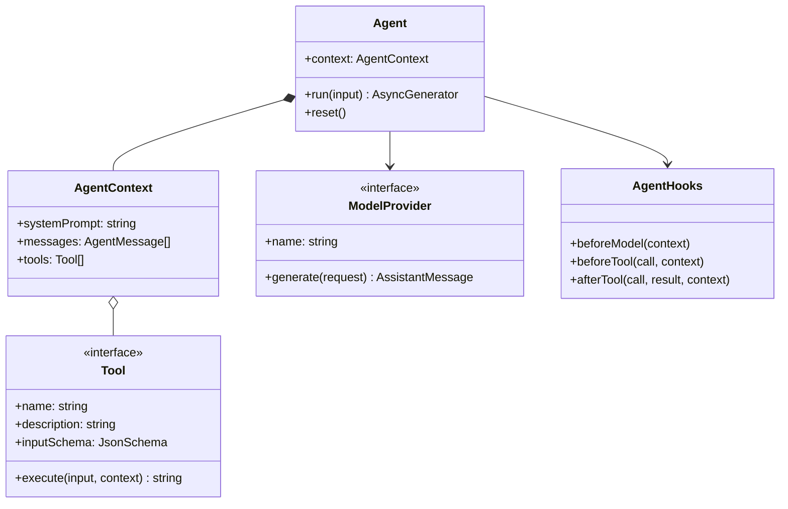

# 架构说明

## 核心关系



`Agent` 只负责持有状态。`agentLoop()` 才是算法，并且也可以脱离 `Agent`
单独使用。这与 pi-agent 暴露高层 `Agent` 和低层 `agentLoop` 的思路一致。

## 一轮调用的数据流

假设用户问“6 × 7 是多少”：

```text
messages = [User("6 × 7 是多少")]
    ↓ model.generate()
Assistant([ToolCall("calculator", { left: 6, right: 7, ... })])
    ↓ tool.execute()
ToolResult("42")
    ↓ append to messages, model.generate() again
Assistant([Text("答案是 42")])
```

历史记录同时是短期 memory，也是模型下一步决策所看到的环境状态。

## Web UI 如何接入

Web UI 没有绕过核心，也没有另写一套 Agent：

```text
Browser
  └─ POST /api/chat
       └─ Agent.run()
            └─ AgentEvent
                 └─ NDJSON response
                      └─ Conversation + Execution trace
```

每个浏览器会话对应一个内存中的 `Agent` 实例。服务端逐行输出 NDJSON，因此工具开始、
工具结束和模型轮次会立即出现在右侧轨迹中。以后把 provider 升级为 token streaming 时，
同一条通道也可以继续发送 text delta，不需要更换前端协议。

## 为什么 provider 返回完整消息

首版 `ModelProvider.generate()` 返回完整 `AssistantMessage`，以便初学者先看清
控制流。对外的 `Agent.run()` 已经是事件流，因此加入 token streaming 时只需：

1. 把 provider 增加为 `stream()`；
2. 在循环中边聚合边发出 delta event；
3. 聚合完成后仍把同样的 `AssistantMessage` 写入 context。

消息结构和工具协议不需要改变。

## Hooks 是扩展腰部

三个 hook 刻意放在 loop 的关键边界：

- `beforeModel`：加载 memory、压缩 context、注入 skill、动态选择模型；
- `beforeTool`：参数校验、权限审批、策略阻断；
- `afterTool`：审计、写长期 memory、更新指标、产生训练轨迹。

hook 可以改变 context，但不应该偷偷执行下一轮循环。控制流始终留在
`agentLoop()`，这样调试时只有一个地方需要检查。

## Sub-agent 为什么可以是 Tool

最小组合方式是把另一个 `Agent.run()` 包装成 `Tool.execute()`：

```text
parent model → call research_agent tool
             → child Agent loop
             → child final answer as tool result
             → parent model
```

这不需要修改核心。需要并行、共享状态、取消传播和预算分配时，再新增 scheduler，
而不是把这些概念提前塞进 `Agent`。

## 安全边界

模型只能“请求”工具，真正的权限始终在宿主程序：

1. 只注册允许模型使用的工具；
2. 在 `beforeTool` 校验参数和审批；
3. 给文件、网络和 shell 工具设置独立 sandbox；
4. 用 `maxTurns`、timeout、token/cost budget 控制资源；
5. self-evolve 只生成版本化候选物，由 eval 和人工 gate 决定是否启用。
