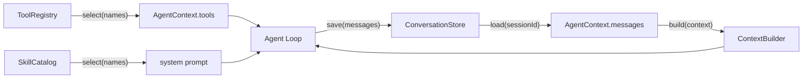

# Tools、Memory、Skills 与 Sub-agent

这些组件经常被混在一个 Agent 类里。教学版把它们分开，因为它们回答的是不同问题：

| 组件 | 回答的问题 | 不负责什么 |
|---|---|---|
| ToolRegistry | 本应用有哪些工具？本 Agent 被授权使用哪些？ | 不执行 Agent loop |
| ConversationStore | 这个 session 之前有哪些消息？ | 不决定本轮发给模型哪些消息 |
| ContextBuilder | 完整历史中的哪些消息进入本轮模型请求？ | 不删除或持久化历史 |
| SkillCatalog | 有哪些指令包？本 Agent 加载哪些？ | 不自动执行代码或开放工具 |
| agentAsTool | 如何把独立 child Agent 委派给父 Agent？ | 不共享父 Agent 私有历史 |



## 常用工具加载

内置 registry 当前注册：

- `calculator`
- `current_time`

注册不等于授权。只有 `select()` 返回的工具才会进入 AgentContext：

```ts
const registry = createBuiltinToolRegistry();
const tools = registry.select(["calculator"]);

const agent = new Agent({ model, tools });
```

CLI 和 Web UI 通过逗号分隔的环境变量选择：

```dotenv
AGENT_TOOLS=calculator,current_time
```

设置成空字符串表示不开放任何工具。未知名称会在启动阶段直接报错，而不是等模型调用后
才发现。

## Conversation Memory

`ConversationStore` 的协议只有三个方法：

```ts
type ConversationStore = {
  load(sessionId: string): Promise<AgentMessage[]>;
  save(sessionId: string, messages: readonly AgentMessage[]): Promise<void>;
  clear(sessionId: string): Promise<void>;
};
```

项目提供三种实现：

### InMemoryConversationStore

适合测试和单进程临时会话，进程退出后数据消失。

### JsonFileConversationStore

适合本地学习和调试：

```dotenv
AGENT_MEMORY_FILE=.agent-data/conversations.json
```

Web UI 使用浏览器 session id 区分对话；CLI 默认使用 `cli`，也可以设置：

```dotenv
AGENT_SESSION_ID=my-learning-session
```

JSON 写入使用临时文件加 rename，并将文件权限设置为 `0600`。它只保证同一 store 实例
内的写入排队，不适合多个 Node 进程共享。

### SqliteConversationStore

适合需要多个 session、进程重启恢复或多个进程协调写入的本地应用：

```dotenv
AGENT_MEMORY_DATABASE=.agent-data/conversations.sqlite3
```

`AGENT_MEMORY_FILE` 和 `AGENT_MEMORY_DATABASE` 只能选择一个。SQLite 每个 session
保存一行 JSON message 数组，用事务完成覆盖与清除，并等待短暂写锁；TypeScript 使用
Node.js 内置 `node:sqlite`，Python 使用标准库 `sqlite3`，表结构一致且都不增加依赖。
数据库仍是明文，请像对待聊天记录一样限制文件访问和备份范围。需要远程服务、高可用或
细粒度查询时，再实现同一接口接 PostgreSQL，而不是修改 Agent loop。

## 构建本轮 Context

`RecentContextBuilder` 保留最近的完整对话轮次，用字符数近似 token budget：

```ts
const agent = new Agent({
  model,
  contextBuilder: new RecentContextBuilder({
    maxMessages: 40,
    maxCharacters: 50_000,
  }),
});
```

也可以通过环境变量启用：

```dotenv
AGENT_CONTEXT_MAX_MESSAGES=40
AGENT_CONTEXT_MAX_CHARACTERS=50000
```

截断只影响本轮 `ModelRequest`，`AgentContext` 与 ConversationStore 仍保留完整历史。
组件按 user message 划分轮次，所以不会只保留 tool result、却丢掉对应的 tool call。
字符数只是便于理解的近似值；生产系统可以实现同一 `ContextBuilder` 接口，改用 tokenizer、
摘要和检索。

!!! info "Memory 不只是一个数据库"
    ConversationStore 负责保存，ContextBuilder 负责本轮上下文，MemoryIndex
    负责跨会话检索；三者没有塞进同一个类。

### Token、摘要与长期记忆

`TokenContextBuilder` 要求注入目标模型的 `TokenCounter`，按完整轮次装填；项目不会把字符
估算包装成“精确 token”。可选 `SummaryProvider` 只摘要被裁掉的旧轮次，并将结果放进
`<conversation_summary>`，ConversationStore 中的原文保持不变。内置
`ExtractiveSummaryProvider` 方便离线学习，生产环境可替换为专用摘要模型。

长期记忆使用独立 `MemoryIndex`：

| kind | 含义 | 示例 |
|---|---|---|
| `episodic` | 发生过的事件 | 上周讨论过发布方案 |
| `semantic` | 稳定事实 | 用户偏好中文回答 |
| `procedural` | 做事规则 | 发布前必须跑测试 |

`SqliteMemoryIndex` 提供持久化和透明的 BM25-like 排序；
`MemoryRecallContextBuilder` 只把当前问题相关的少量记录注入 prompt。配置入口：

```dotenv
AGENT_MEMORY_INDEX_DATABASE=.agent-data/memory-index.sqlite3
AGENT_MEMORY_RECALL_LIMIT=5
```

记录由应用显式写入，而不是让模型未经确认地“记住一切”：

```ts
await memoryIndex.upsert({
  id: "user-language",
  kind: "semantic",
  content: "用户偏好中文回答",
  createdAtUnixMs: Date.now(),
});
```

## 读取 SKILL.md

Skill 目录采用简单结构：

```text
skills/
└── tool-first/
    └── SKILL.md
```

frontmatter 可声明版本、依赖、检索标签和所需工具：

```yaml
name: report
description: 生成可靠报告
version: 1.2.0
dependencies: citations
tags: report, 报告
tools: web_search
```

Catalog 会拓扑加载依赖并拒绝循环。`discover()` 使用可解释的 BM25-like 排序；需要语义
判断时可注入 `ModelSkillRouter`，但模型只能返回候选名称，最终仍经过白名单、去重、数量、
依赖和工具权限检查。`tools` 是需求声明，不会自动注册或授权工具。

文件由 frontmatter 和 Markdown 指令组成：

```markdown
---
name: tool-first
description: 在精确任务中优先使用工具
---

# Tool First

先检查可用工具，再回答。
```

启用：

```dotenv
AGENT_SKILLS_DIR=skills
AGENT_SKILLS=tool-first
```

也可以使用动态发现：

```dotenv
AGENT_SKILLS=auto
```

`SkillCatalog.discover()` 会对最新用户输入与 skill 的 name/description 做透明关键词评分，
`createDynamicSkillHook()` 再把命中的少量 skill 注入 prompt。它不需要额外模型调用，适合
教学和少量 skill；这不是语义检索，skill 数量增加后应替换为 BM25、embedding 或模型路由。

Loader 有意设置以下边界：

- 单个文件最多 256 KiB；
- 教学版 frontmatter 只读取 `name` 和 `description`；
- 只读取 `SKILL.md` 文本；
- 不 import JavaScript、不运行 shell；
- skill 不会自动获得工具权限。

只有 `SkillCatalog.select()` 选中的指令会带明确边界注入 system prompt。把所有 skill
全文都塞给模型会增加噪音、成本和 prompt injection 面积。

## 把 child Agent 作为工具

`agentAsTool()` 是 Sub-agent 的第一个最小原语：

```ts
const researcher = agentAsTool({
  name: "researcher",
  description: "委派一个独立研究任务",
  createAgent: () =>
    new Agent({
      model,
      tools: [searchTool],
      maxTurns: 4,
    }),
});

const parent = new Agent({ model, tools: [researcher] });
```

每次 tool call 都通过 factory 创建新 child，因此不会共享父 Agent 或其他任务的可变
messages。child 只收到结构化 `task`，父级取消信号会继续传递；child 的工具权限、
memory 和预算都要显式配置。`runSubagent()` 返回结构化 handoff，`SubagentScheduler`
负责有界并发，`AgentEventBus` 只汇总带父子 ID 的事件。

## 下一步扩展点

- ToolRegistry：工具权限、租户策略、lazy loader；
- ConversationStore：加密、TTL、PostgreSQL；
- ContextBuilder：接入具体 provider tokenizer 和摘要模型；
- MemoryIndex：embedding、混合检索和 reranker；
- SkillCatalog：远程 registry、签名与兼容性策略；
- orchestration：持久化 event bus、分布式 scheduler 和远程 worker。

## 三套实现的对应关系

| 能力 | TypeScript from scratch | Python from scratch | pi-agent direct |
|---|---|---|---|
| 工具加载 | `ToolRegistry` | `ToolRegistry` | `PiToolRegistry` + `AgentTool` |
| 参数校验 | 教学 JSON Schema 子集 | 同一 Schema 子集 | pi-agent/TypeBox 原生校验 |
| 会话 memory | JSON / `SqliteConversationStore` | JSON / `SqliteConversationStore` | 通用 JSON/SQLite store + pi messages |
| Skill | `SkillCatalog` | Python `SkillCatalog` | 复用 TypeScript loader/catalog |
| Timeout/retry | `ModelCallPolicy` | Python `ModelCallPolicy` | pi-ai 原生 stream options |
| Token/摘要 Context | `TokenContextBuilder` | `TokenContextBuilder` | pi-agent 原生 context + 通用 memory recall |
| Sub-agent / Graph | handoff、scheduler、`StateGraph` | 同语义同步实现 | 作为 graph node 或 scheduler worker |
