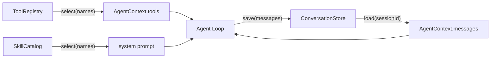

# Tools、Memory 与 Skills

这三个组件经常被混在一个 Agent 类里。教学版把它们分开，因为它们回答的是三个不同问题：

| 组件 | 回答的问题 | 不负责什么 |
|---|---|---|
| ToolRegistry | 本应用有哪些工具？本 Agent 被授权使用哪些？ | 不执行 Agent loop |
| ConversationStore | 这个 session 之前有哪些消息？ | 不做摘要和语义检索 |
| SkillCatalog | 有哪些指令包？本 Agent 加载哪些？ | 不自动执行代码或开放工具 |



## 常用工具加载

内置 registry 当前注册：

- `calculator`
- `current_time`

注册不等于授权。只有 `select()` 返回的工具才会进入 AgentContext：

```ts
const registry = createBuiltinToolRegistry();
const tools = registry.select(["calculator"]);

const agent = new Agent({ model, tools });
```

CLI 和 Web UI 通过逗号分隔的环境变量选择：

```dotenv
AGENT_TOOLS=calculator,current_time
```

设置成空字符串表示不开放任何工具。未知名称会在启动阶段直接报错，而不是等模型调用后
才发现。

## Conversation Memory

`ConversationStore` 的协议只有三个方法：

```ts
type ConversationStore = {
  load(sessionId: string): Promise<AgentMessage[]>;
  save(sessionId: string, messages: readonly AgentMessage[]): Promise<void>;
  clear(sessionId: string): Promise<void>;
};
```

项目提供两种实现：

### InMemoryConversationStore

适合测试和单进程临时会话，进程退出后数据消失。

### JsonFileConversationStore

适合本地学习和调试：

```dotenv
AGENT_MEMORY_FILE=.agent-data/conversations.json
```

Web UI 使用浏览器 session id 区分对话；CLI 默认使用 `cli`，也可以设置：

```dotenv
AGENT_SESSION_ID=my-learning-session
```

JSON 写入使用临时文件加 rename，并将文件权限设置为 `0600`。它只保证同一 store 实例
内的写入排队，不适合多个 Node 进程共享。生产环境应实现同一个接口并换成
SQLite/PostgreSQL。

!!! info "Memory 不只是一个数据库"
    当前实现的是 ConversationStore。后续的 ContextBuilder 负责截断与摘要，
    MemoryIndex 负责跨会话检索；三者不应塞进同一个类。

## 读取 SKILL.md

Skill 目录采用简单结构：

```text
skills/
└── tool-first/
    └── SKILL.md
```

文件由 frontmatter 和 Markdown 指令组成：

```markdown
---
name: tool-first
description: 在精确任务中优先使用工具
---

# Tool First

先检查可用工具，再回答。
```

启用：

```dotenv
AGENT_SKILLS_DIR=skills
AGENT_SKILLS=tool-first
```

Loader 有意设置以下边界：

- 单个文件最多 256 KiB；
- 教学版 frontmatter 只读取 `name` 和 `description`；
- 只读取 `SKILL.md` 文本；
- 不 import JavaScript、不运行 shell；
- skill 不会自动获得工具权限。

只有 `SkillCatalog.select()` 选中的指令会带明确边界注入 system prompt。把所有 skill
全文都塞给模型会增加噪音、成本和 prompt injection 面积。

## 下一步扩展点

- ToolRegistry：工具权限、租户策略、lazy loader；
- ConversationStore：SQLite、加密、TTL；
- ContextBuilder：token budget、摘要、检索结果排序；
- SkillCatalog：基于描述的动态选择、依赖检查和版本信息。

## 三套实现的对应关系

| 能力 | TypeScript from scratch | Python from scratch | pi-agent direct |
|---|---|---|---|
| 工具加载 | `ToolRegistry` | `ToolRegistry` | `PiToolRegistry` + `AgentTool` |
| 参数校验 | 教学 JSON Schema 子集 | 同一 Schema 子集 | pi-agent/TypeBox 原生校验 |
| 会话 memory | `JsonFileConversationStore` | `JsonFileConversationStore` | 通用 JSON store + pi messages |
| Skill | `SkillCatalog` | Python `SkillCatalog` | 复用 TypeScript loader/catalog |
| Timeout/retry | `ModelCallPolicy` | Python `ModelCallPolicy` | pi-ai 原生 stream options |
