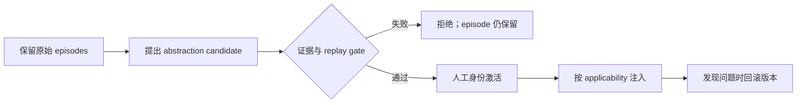

# 证据优先的记忆整合

Stage 16 来自 2026 年论文
[Useful Memories Become Faulty When Continuously Updated by LLMs](https://arxiv.org/abs/2605.12978)
的工程启发。论文发现：让 LLM 持续重写“经验总结”，原本有用的记忆可能逐轮退化，甚至不如
完全不用记忆；更新时机不同，也可能让同一批轨迹产生不同结果。

这不是论文代码的逐行复现，而是一个适合初学者阅读的安全实现：**原始 episode 是证据，
抽象 memory 是待审查的版本化候选**。候选永远不能覆盖原始轨迹。



## 四个不能省略的边界

1. `Episode` 不可变。同一个 id 不能被另一条轨迹覆盖，也没有 consolidation 删除入口。
2. `EvidenceLink` 同时记录支持证据与反例，避免只看成功案例后过度概括。
3. `Applicability` 使用显式 `allTags` / `noneTags`。宿主负责给当前任务打标签，不能让
   一段未审查的模型输出自行扩大适用范围。
4. `evaluate()` 在激活前检查证据数量、任务多样性、适用边界和确定性 replay；
   `activate()` 还要求明确的操作者身份，并保留版本用于 rollback。

## TypeScript 最小示例

```ts
import { GovernedMemoryBank } from "./src/memory-consolidation/index.js";

const bank = new GovernedMemoryBank();
bank.retain({
  id: "csv-1", scope: "csv-import", taskId: "task-a",
  tags: ["data", "csv"], input: "导入文件", trajectory: "原始执行轨迹",
  outcome: "success", createdAt: new Date().toISOString(),
});

// 实际 candidate 还应引用至少两个不同 task 的支持 episode 和一条反例。
const memories = bank.active(["data", "csv"]);
```

完整的“错误概括被拒绝、正确概括通过、第二版发布后回滚”示例位于
`tests/memory-consolidation.test.ts` 和 `python/tests/test_memory_consolidation.py`。
网页实验台的 **Memory gate** 可直接运行同一流程，不需要 API Key。

## 为什么不让 LLM 直接更新 prompt

LLM 可以生成 `propose()` 的输入，但 gate 与 active pointer 属于宿主程序。这样做把
“模型认为这条经验有用”和“系统允许它影响未来任务”分成两个决定。真正上线时，可以把
内存 store、人工审批和 replay evaluator 替换成持久化实现，数据模型与控制流不需要改变。

!!! note "实现范围"
    教学版 evaluator 返回布尔结果，replay case 由开发者固定。生产系统还需要污染检测、
    数据集版本、租户隔离、统计显著性和发布后的在线监控。
