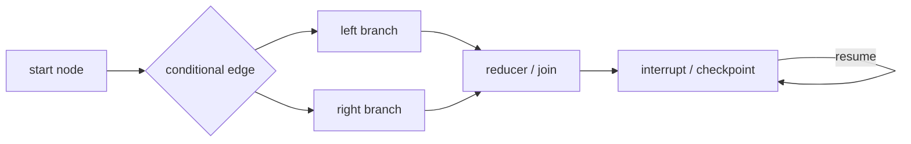

# Sub-agent、Multi-agent 与 Graph

普通 Agent 仍然使用小型 `model → tool → model` loop。只有任务需要委派、并行、审批或
恢复时，才在外层增加 orchestration。

## 结构化 Sub-agent

`runSubagent()` 每次创建独立 child，并返回 `HandoffResult`：状态、输出、父子 ID、depth、
turn、token、耗时和错误都显式可见。默认不传父历史；只有 `selectContext()` 返回的新数组
会复制给 child。

```ts
const result = await runSubagent({
  task: "检查这份报告",
  agentId: "reviewer-1",
  parentAgentId: "writer",
  createAgent: () => createReviewer(),
  policy: { maxDepth: 2, maxTurns: 4, maxTokens: 20_000, timeoutMs: 30_000 },
  selectContext: (messages) => messages.slice(-2),
});
```

父 `AbortSignal` 会传给 child，timeout 使用同一取消机制。Python 同步模型无法强制杀死
任意阻塞线程，因此 timeout 会停止等待并返回 cancelled；生产异步 Python 应让 provider
主动响应取消。

`SubagentScheduler` 有界并发执行 child，并保持结果与输入任务同序；`AgentEventBus` 用
`agentId/parentAgentId` 汇总事件，但不会共享消息数组。

## 独立 Graph runtime



`StateGraph` 的 node 接收只读 state 并返回 partial update；edge 决定下一节点。`GraphFork`
让多个分支读取各自的 state 副本，reducer 以稳定顺序合并。配置 checkpoint store 后，每步
记录 state 和下一节点；node 调用 `interrupt(value)` 可暂停，之后携带 `resumeValue` 从同一
节点继续。

Graph 不替代 Agent loop。一个 node 可以运行普通函数、工具、from-scratch Agent 或
pi-agent；图只管理工作流状态和路径，不接管模型协议。
