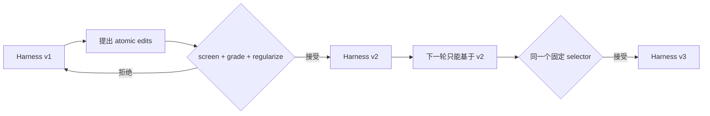

# 受控的 Recursive Self-Improvement

Stage 17 综合了两篇 2026 年 9 月的新论文：

- [Recursive self-improvement of AI research agents](https://arxiv.org/abs/2609.26457)
  提出的 AIDE²：每次被选中的 Agent rewrite 成为下一轮被改写的对象，并用固定任务预算与
  私有评分选择 incumbent；
- [RRSI: Regularized Recursive Self-Improvement of Agent Harnesses](https://arxiv.org/abs/2609.24972)
  指出 harness evolution 会对有限 evolve set 过拟合，并加入退火 edit budget、历史证据、
  泄漏筛查、噪声带、成本约束、探索和剪枝。

这两篇很适合本项目，因为它们改进的是 frozen model 外面的 **harness**：prompt、控制流、
工具、memory、skills、context 和 sub-agent，而不是要求初学者训练模型权重。

!!! note "这是工程化教学实现"
    本模块复现关键控制流和不变量，不宣称复现论文的模型、数据集或实验结果。模型可以提出
    harness 内容和 atomic edit，但不能改 selector、私有 verifier、预算或审批代码。

## 从 self-evolve 到 RSI

Stage 6 验证的是一次 `baseline → candidate`。RSI 多了一条 lineage：



`RegularizedRsiController.select()` 是唯一能移动 active incumbent 的入口。每个 accepted
version 的 `parentVersion` 都指向当轮 incumbent，因此 lineage 可检查，也可以回滚。

## 六层约束

1. **公开反馈与私有选择分离**：`publicScore` 可进入 proposer evidence；`selectionScore`
   只留在固定 selector，`proposalContext()` 不包含它或私有样例。
2. **固定总预算**：超过 `maxPolicyTokens` 的候选直接不 admissible，不能靠多花 token 获胜。
3. **退火 atomic edit budget**：使用 RRSI 的 cosine schedule，前期探索，后期逐渐变成单一、
   可归因的修改。
4. **评测前泄漏筛查**：diff 命中受保护的 task 名、答案或实体时，不消耗评测预算。
5. **噪声与成本正则**：候选不能低于历史最好分数的噪声下界；成本增长必须由超过噪声带的
   分数增长解释。
6. **负证据与剪枝**：被拒绝的 hypothesis 仍写入 history；近期没有正收益的 component 会
   出现在 `pruningTargets`，而搜索停滞时会提示未探索 component。

## TypeScript 最小流程

```ts
const controller = new RegularizedRsiController(initial, initialGrade, grader, {
  totalRounds: 4,
  minEditBudget: 1,
  maxEditBudget: 3,
});

const context = controller.proposalContext();
const candidate = controller.propose(newHarness, atomicEdits);
await controller.evaluate(candidate.id);
const nextIncumbent = controller.select([candidate.id], "human-reviewer");
```

Python 的方法名称与流程相同。pi-agent 版使用
`createPiAgentFromHarness(controller.incumbent())` 为每个候选创建隔离实例，不修改
pi-agent 内部 loop。

网页实验台的 **Regularized RSI** 不需要 API Key：它会展示泄漏候选、高分但成本翻倍的
候选如何被拒绝，以及可复用候选如何连续形成 `v1 → v2 → v3`。

## 近期还值得跟踪的方向

[MetaSkill-Evolve](https://arxiv.org/abs/2607.05297) 把 task skill 放在快循环，把负责改进 skill
的方法放在慢循环。它适合未来在本模块上增加 branch-local meta-skill；但当前阶段先固定
selector，避免初学者误以为“递归”就等于允许 Agent 修改自己的安全边界。
