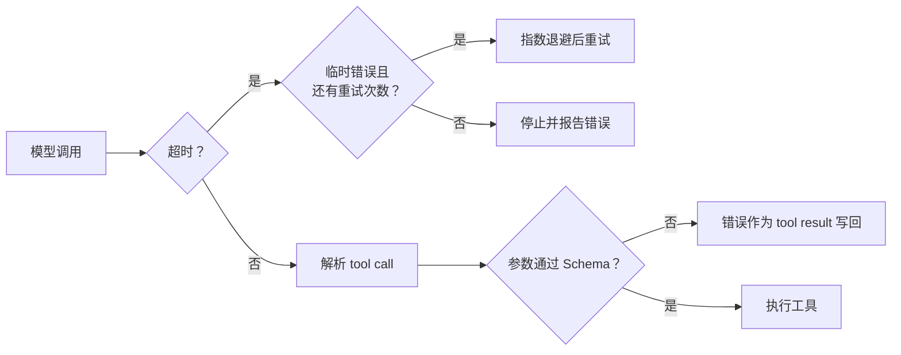

# 可靠性模块

最小 Agent loop 让流程跑通之后，最先应该补的不是 multi-agent，而是三条基础防线：



## 工具参数校验

JSON Schema 不只是给模型看的提示。模型输出是不可信的外部输入，必须在执行函数前再次
校验。

`src/core/tool-validation.ts` 实现了教学项目当前需要的子集：

- `required`：必填字段；
- `type`：字符串、数字、布尔值、数组、对象等；
- `enum`：允许值集合；
- `additionalProperties: false`：拒绝未知字段。

校验失败不会让 Agent 直接崩溃，也不会执行工具。错误会成为 `tool` 消息进入 Context，
模型可以在下一轮修正参数。

!!! warning "这是可读性优先的 Schema 子集"
    它不是完整 JSON Schema 实现。生产项目需要复杂的嵌套结构、格式或组合关键字时，
    应替换为 Ajv 等成熟 validator。

## Timeout

`src/core/model-call.ts` 用 `Promise.race` 限制单次模型调用时间，同时把 AbortSignal 传给
provider。即使某个 provider 忽略取消信号，外层 Agent 也能及时结束等待。

```ts
const agent = new Agent({
  model,
  modelCall: {
    timeoutMs: 30_000,
  },
});
```

`timeoutMs: 0` 表示不设置超时，但用户主动取消仍然有效。

## Retry 与指数退避

不是所有失败都应该重试：

| 错误 | 默认重试 | 原因 |
|---|---:|---|
| timeout / 网络断开 | 是 | 下一次可能恢复 |
| HTTP 429 | 是 | 临时限流 |
| HTTP 5xx | 是 | 服务端临时故障 |
| API Key 无效 | 否 | 重试无法修复 |
| 请求参数错误 | 否 | 必须修改请求 |

每次重试前的等待时间按 `delay × 2^attempt` 增长，并受最大延迟限制。首次请求不计入
`maxRetries`，因此 `maxRetries: 2` 最多会发出三次请求。

```ts
const agent = new Agent({
  model,
  modelCall: {
    maxRetries: 2,
    retryDelayMs: 500,
    maxRetryDelayMs: 8_000,
  },
});
```

CLI 和 Web UI 可以通过 `.env` 配置：

```dotenv
AGENT_MODEL_TIMEOUT_MS=120000
AGENT_MODEL_MAX_RETRIES=1
AGENT_RETRY_DELAY_MS=500
```

## 为什么独立成模块

`agent-loop.ts` 仍然只负责“模型 → 工具 → 模型”的控制流。参数校验和模型调用策略可以
单独测试、替换和继续扩展，后续加入限流、熔断、预算时不需要重写 Agent loop。
