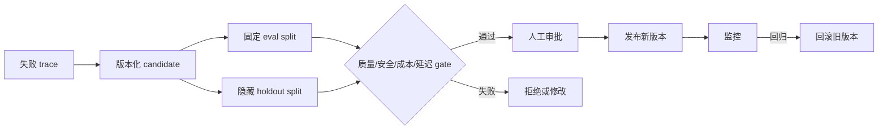

# 受控 Self-evolve

Self-evolve 不是让 Agent 直接重写正在运行的 prompt，更不是让它修改线上代码。这里实现的
是一个小型、可审计的软件发布闭环：模型可以提出候选，人和确定性 gate 决定是否发布。



## 四种 Artifact

`ArtifactVersion` 只允许 `prompt`、`skill`、`toolDescription` 和 `routingPolicy`。它不接受
任意可执行代码。每个版本包含 artifact ID、正整数版本、内容、创建时间和父版本；写入
`ArtifactStore` 后，同一 ID 与版本号不能覆盖。

```ts
store.put({
  artifactId: "support-prompt",
  kind: "prompt",
  version: 1,
  content: "回答前先核对订单事实。",
  createdAt: "2026-08-01T00:00:00Z",
});
store.activate("support-prompt", 1);
```

这不是密码学意义上的不可变存储。教学版通过接口和拒绝覆盖表达不变量；生产环境应使用
数据库唯一约束、对象存储版本或签名制品。

## 固定 Dataset 与二元评分

每条 `EvalCase` 都属于 `eval` 或 `holdout`。Controller 在创建时复制数据集，baseline 与
candidate 严格运行相同样例。Evaluator 必须返回明确的 `passed` 和 `safetyPassed`，以及
token、成本和延迟；不使用含义模糊的 1–5 分平均值。

```ts
const evaluator: ArtifactEvaluator = async (artifact, testCase) => {
  const started = Date.now();
  const output = await runInSandbox(artifact.content, testCase.input);
  return {
    output,
    passed: output.includes(testCase.expected ?? ""),
    safetyPassed: !output.includes("敏感数据"),
    tokens: readUsage(),
    cost: readCost(),
    latencyMs: Date.now() - started,
  };
};
```

上面的字符串判断只适合演示。真实 rubric 应来自人工查看失败样本后的具体标准。如果使用
LLM-as-judge，必须先拿人工标注集验证 judge 的一致性，不能让未经验证的 judge 决定发布。

## Gate、审批和发布

默认 gate 要求 eval/holdout 通过率至少 80%，相对 baseline 不退化，全部安全检查通过，
并限制 token、成本和延迟增幅为 20%。这些只是保守示例，业务应显式传入自己的
`GatePolicy`。

```ts
const candidate = controller.propose({
  artifactId: "support-prompt",
  kind: "prompt",
  content: "先核对订单事实；信息不足时明确追问。",
  rationale: "修复 trace 中的无依据退款承诺",
  failureTraceIds: ["trace-1042"],
});

const evaluated = await controller.evaluate(candidate.id);
if (evaluated.report?.gate.passed) {
  controller.approve(candidate.id, "reviewer@example.com", "人工抽查通过");
  controller.publish(candidate.id, "release-bot");
}
```

`publish()` 无法跳过 `evaluate()` 与 `approve()`。回滚只能激活 store 中已经存在的旧版本，
并记录 actor、时间和目标版本。教学版的人工身份只是非空字符串；生产服务必须把审批接口
接到真实认证、权限和审计系统。

发布后可调用 `monitorActive()`，再次用相同 evaluator、dataset 和 gate 对 active version
与父版本做回归检查，并保存 `MonitoringRecord`。它不会自动回滚；宿主确认告警后再显式调用
`rollback()`，避免一次随机评测直接改变线上状态。生产环境还应把这里替换或补充为真实流量
指标与告警系统。

## 与三种 Agent 实现的关系

Evolution runtime 不依赖某个模型 provider。from-scratch TypeScript、Python 和 pi-agent
都可以成为 `ArtifactEvaluator` 背后的 runner。pi-agent 的 `createPiAgent({ systemPrompt })`
和 `runPiAgentHandoff({ systemPrompt })` 会为每个 prompt artifact 创建隔离实例，不会修改
已运行 Agent 的 prompt。

Self-evolve 仍然在 Agent loop 外层。失败 trace 可以来自 observability 模块，候选可以由
Agent 或人提出，但固定数据集、release policy、审批身份和 active version 都属于宿主系统。
