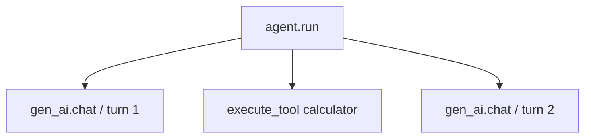

# 可观测性与 Trace

Agent 不只调用一次模型：一次任务可能经历多轮模型请求和多个工具调用。只看最终答案，
很难判断时间花在哪里、哪个工具失败，或者一次调用属于哪项任务。

本项目提供一个零依赖的 OpenTelemetry-compatible 教学实现。它把一次 `Agent.run()` 记为
根 span，把模型和工具调用记为子 span：



事件流与 trace 解决不同问题：`AgentEvent` 用于让 CLI/Web UI 立即更新；span 用于持久化
调用层级、耗时、状态和 token usage。两者都不改变 Agent loop 的控制流。

## 开启 JSONL trace

在 `.env` 中设置一个文件路径：

```dotenv
AGENT_TRACE_FILE=.agent-data/traces.jsonl
```

TypeScript CLI/Web、Python CLI 和 pi-agent 示例都会启用相同结构的 trace。每行是一个
已完成的 span，子 span 先写入，最后写入根 span：

```json
{"traceId":"...","spanId":"...","parentSpanId":"...","name":"gen_ai.chat","kind":"CLIENT","startTimeUnixNano":"...","endTimeUnixNano":"...","attributes":{"gen_ai.operation.name":"chat","gen_ai.provider.name":"minimax"},"status":{"code":"OK"}}
```

主要 span 和属性如下：

| span | 说明 | 常用属性 |
|---|---|---|
| `agent.run` | 一次完整任务 | `gen_ai.provider.name` |
| `gen_ai.chat` | 一次模型调用 | `agent.turn`、`gen_ai.usage.*` |
| `execute_tool <name>` | 一次工具执行 | `gen_ai.tool.name`、`gen_ai.tool.call.id` |

`traceId` 在一次 run 内保持一致；子 span 的 `parentSpanId` 指向 `agent.run`。时间使用 Unix
纳秒字符串，避免 JavaScript 大整数精度损失。

## 默认不记录敏感正文

教学 exporter 默认不记录 prompt、模型正文、工具参数和工具结果，只记录名称、层级、状态、
时间和 usage。这样打开 trace 不会自动复制整段对话。错误消息可能来自 provider 或工具，
仍应为 trace 文件设置合适的访问权限和保留周期。

## 如何接真正的 OpenTelemetry

核心只依赖很小的 exporter 边界：TypeScript 的 `TraceExporter` 和 Python 的
`SpanExporter`。生产环境可以实现这个接口，把 `TraceSpanRecord` 转为真实 OTel SDK span，
再通过 OTLP 发给 collector；Agent loop 不需要修改。

JSONL exporter 适合学习、单机调试和日志采集，不负责批处理、采样、跨进程 context
传播或 OTLP。exporter 写入失败不会中断 Agent 主任务，可通过错误回调接入应用日志。
