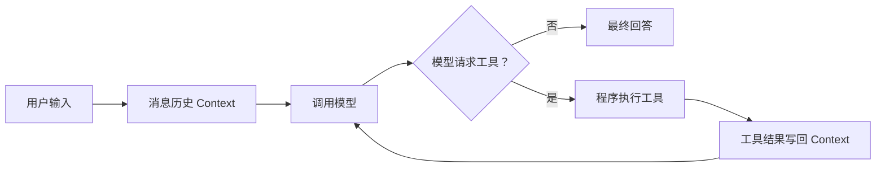

# Building Agents from Scratch

从一个不到百行的反馈环开始，亲手看懂模型如何调用工具，再逐步走向 memory、skills、
sub-agent、graph 和 self-evolve。

这个项目不是把成熟框架重新包装一遍。它提供三条可以互相对照的学习路径：

-   :material-language-python: **Python：先看懂**

    ---

    语法负担最小，适合第一次理解 `模型 → 工具 → 模型`。

    [开始阅读 Python 版](implementations/python.md)

-   :material-language-typescript: **TypeScript：再工程化**

    ---

    核心代码有逐段中文注释，并加入异步事件、取消和 Web UI。

    [开始阅读 TypeScript 版](implementations/typescript.md)

-   :material-package-variant: **pi-agent：最后对照成熟实现**

    ---

    直接使用 pi-agent API，观察成熟库替你解决了哪些问题。

    [查看 pi-agent 版](implementations/pi-agent.md)

## 一眼看懂 Agent

Agent 和普通聊天的关键区别不是 system prompt，而是上图中最后两条边：
**工具结果必须回到消息历史，模型才能基于真实结果继续思考。**

!!! tip "推荐顺序"
    先运行 [Notebook](notebook.md)，再阅读 Python 核心循环，之后按需要进入
    TypeScript 或 pi-agent。不要从 provider 的 HTTP 代码开始。

## 你会得到什么

- 一个不依赖框架的 TypeScript Agent loop；
- 一个结构对齐、仅依赖标准库的 Python 版本；
- 一个无需 API Key 的可执行教学 Notebook；
- 一个直接使用 `@earendil-works/pi-agent-core` 的对照示例；
- 一个能看见 model、tool call、tool result 和完成状态的 Web UI；
- 可按名称授权的 ToolRegistry、可持久化 ConversationStore 和 SKILL.md loader；
- 从 memory 到 self-evolve 的渐进式扩展路线。

[5 分钟跑起来 :material-arrow-right:](getting-started.md){ .md-button .md-button--primary }
