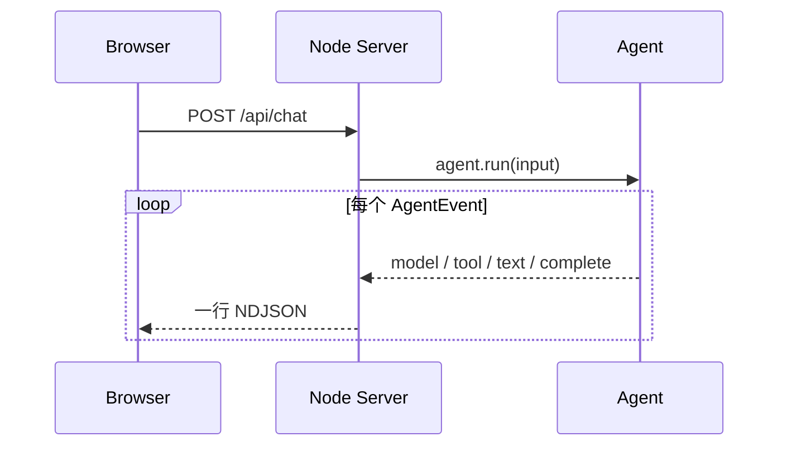

# Web UI

运行：

```bash
npm run web
```

访问 `http://127.0.0.1:3000`。

## 页面在展示什么

左侧是对话，右侧是 Agent 的真实执行轨迹：



页面持续显示运行状态与耗时；长对话和长轨迹分别滚动。超过一段时间没有新事件时，会
明确显示仍在等待模型，而不是让用户猜测是否卡住。运行期间可以点击“停止”取消请求。

## 为什么使用 NDJSON

每个事件是一行 JSON，浏览器可以边读取边渲染，不必等待完整响应。它比一次性 JSON
更适合 Agent，也比第一版就引入 WebSocket 更容易阅读和调试。
