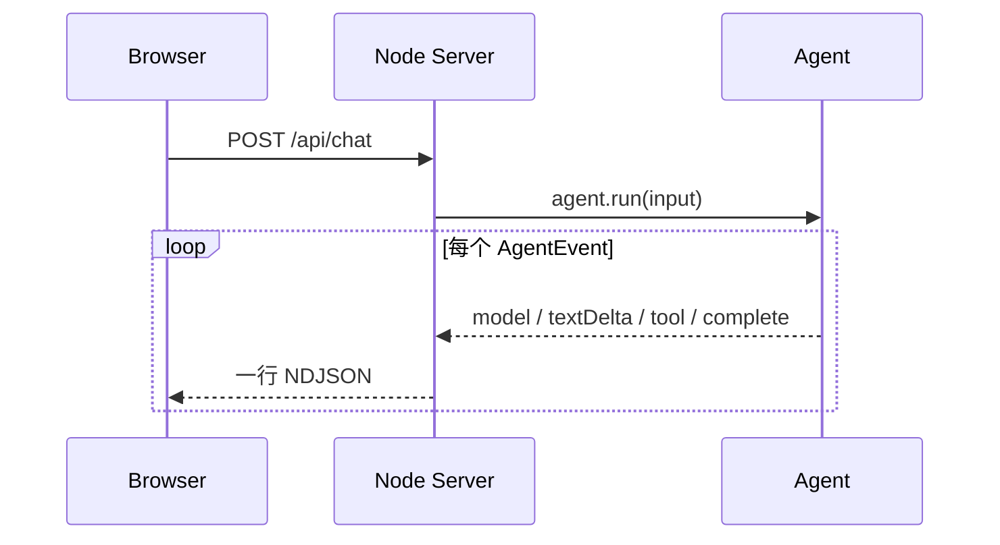

# Web UI

## 两个入口

- `/`：真实模型对话与基础 Agent loop 轨迹；
- `/playground.html`：无需 API Key 的高级组件实验台。

实验台会运行真实 Memory、Skills、Sub-agent、Graph、Evolution、Trace Replay 和 Workspace
组件，但使用固定输入与脚本化假模型。每一步输入、状态变化和最终结果都会展开显示，适合在
阅读源码前建立直觉。

运行：

```bash
npm run web
```

访问 `http://127.0.0.1:3000`。

## 页面在展示什么

左侧是对话，右侧是 Agent 的真实执行轨迹：



页面持续显示运行状态与耗时；长对话和长轨迹分别滚动。超过一段时间没有新事件时，会
明确显示仍在等待模型，而不是让用户猜测是否卡住。运行期间可以点击“停止”取消请求。

MiniMax provider 现在会把 SSE 的 `textDelta` 直接穿过 Agent 和 NDJSON 通道交给浏览器，
所以回答会边生成边显示。`thinkingDelta` 只更新“模型正在推理”的状态，不展示内部思考
正文；`toolArgumentsDelta` 会显示“正在生成工具参数”，完整 JSON 形成后才校验和执行。

每个带 usage 的完整模型响应还会新增一张 `USAGE` 轨迹卡，展示累计 input、output 和
total token；配置单价后也会显示对应币种的估算成本。它同时让用户能分辨“还在运行”和
“已经完成但没有继续调用模型”。

触发主动限流时，页面状态会显示预计等待秒数，并新增 `RATE LIMIT` 轨迹卡。等待结束后
任务自动继续，也可以随时点击“停止”取消，不会再被误认为模型或页面卡死。

开启并行工具后，右侧会先出现同一轮的多张 `TOOL CALL` 卡片；工具完成事件仍按模型 call
顺序展示，与写入 Context 的顺序一致。

## 为什么使用 NDJSON

每个事件是一行 JSON，浏览器可以边读取边渲染，不必等待完整响应。模型服务到 Node
使用 SSE，Node 到浏览器使用 NDJSON：两段协议职责清晰，也比第一版就引入 WebSocket
更容易阅读和调试。
